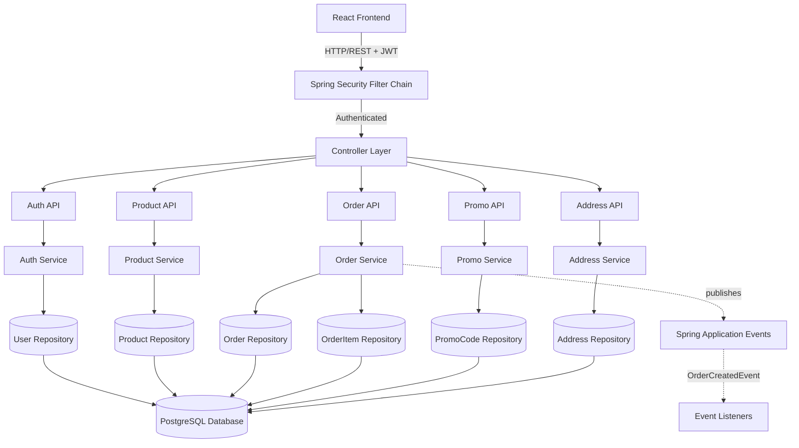
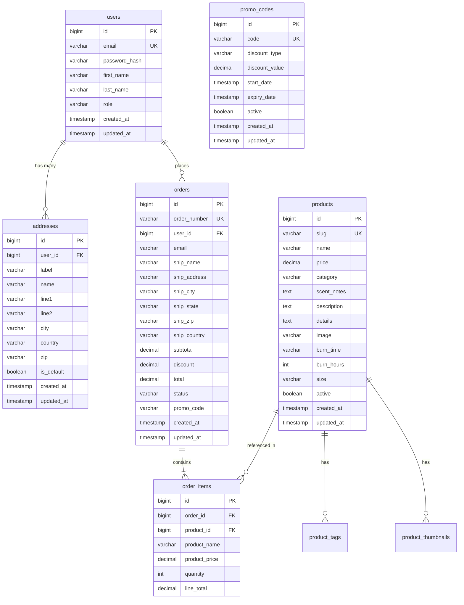
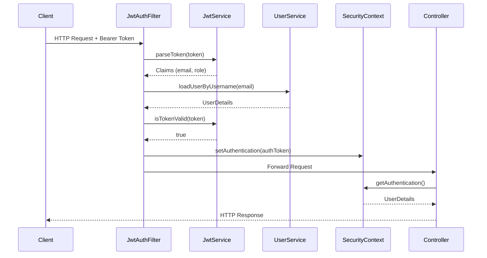

# Technical Design Document

## Overview

### Purpose

This document provides the technical design for the LUMOS-AURA e-commerce platform backend REST API. The system implements a Spring Boot 4.1.0 application with PostgreSQL database, providing authentication, product catalog management, order processing, promotional codes, and address management capabilities for a luxury candle e-commerce store.

### Scope

The design covers:
- High-level system architecture using Spring Modulith patterns
- Database schema with tables, relationships, and constraints
- REST API endpoint specifications with request/response formats
- Security configuration and JWT authentication flow
- Implementation details for core components
- Testing strategy including property-based testing approach

### Technology Stack

- **Framework**: Spring Boot 4.1.0
- **Architecture Pattern**: Spring Modulith 2.1.0 (Modular Monolith)
- **Language**: Java 17
- **Database**: PostgreSQL 16+
- **Security**: Spring Security 7.x with JWT
- **ORM**: Spring Data JPA (Hibernate)
- **Build Tool**: Gradle 8.x
- **Testing**: JUnit 5, jqwik (property-based testing), Spring Boot Test
- **Migration**: Flyway

### Key Design Principles

1. **Modular Monolith**: Organize code into logical modules with clear boundaries
2. **Domain-Driven Design**: Align module structure with business domains
3. **Event-Driven Communication**: Use application events for cross-module interaction
4. **Stateless Authentication**: JWT tokens for scalable authentication
5. **API-First Design**: REST API following standard conventions
6. **Data Integrity**: Enforce constraints at database and application level
7. **Property-Based Testing**: Verify correctness through universal properties


## Architecture

### Spring Modulith Module Structure

The application is organized into five logical modules following Spring Modulith patterns:

```
com.example.be
├── auth/              # Authentication & Authorization Module
│   ├── domain/        # User entity, UserRole enum
│   ├── api/           # AuthController (public)
│   ├── internal/      # UserService, JwtService (package-private)
│   └── security/      # SecurityConfig, JwtAuthFilter
├── product/           # Product Catalog Module
│   ├── domain/        # Product entity
│   ├── api/           # ProductController (public)
│   └── internal/      # ProductService (package-private)
├── order/             # Order Management Module
│   ├── domain/        # Order, OrderItem entities
│   ├── api/           # OrderController (public)
│   ├── internal/      # OrderService (package-private)
│   └── events/        # OrderCreatedEvent (public)
├── promo/             # Promotional Code Module
│   ├── domain/        # PromoCode entity
│   ├── api/           # PromoController (public)
│   └── internal/      # PromoService (package-private)
└── address/           # Address Management Module
    ├── domain/        # Address entity
    ├── api/           # AddressController (public)
    └── internal/      # AddressService (package-private)
```

### Module Boundaries

**Public APIs (exported):**
- Controller classes in `api` packages
- Domain entities in `domain` packages (DTOs for external communication)
- Event classes in `events` packages

**Internal APIs (not exported):**
- Service classes in `internal` packages
- Repository interfaces
- Utility classes

**Module Communication:**
- Modules communicate via published application events (Spring `ApplicationEvent`)
- No direct service-to-service calls across module boundaries
- Shared data accessed through APIs or event payloads


### System Architecture Diagram



### Request Flow Example: Create Order

1. **Client** sends POST request to `/api/orders` with JWT token and order data
2. **JwtAuthFilter** validates token, extracts user identity, sets SecurityContext
3. **OrderController** receives request, validates authorization
4. **OrderService** validates product slugs via ProductService API
5. **OrderService** validates promo code via PromoService API (if provided)
6. **OrderService** calculates totals, creates Order and OrderItem entities
7. **OrderRepository** persists entities to PostgreSQL
8. **OrderService** publishes `OrderCreatedEvent` to application event bus
9. **OrderController** returns created order with HTTP 201


## Components and Interfaces

### Auth Module

#### User Entity

```java
@Entity
@Table(name = "users", indexes = {
    @Index(name = "idx_user_email", columnList = "email")
})
public class User {
    @Id
    @GeneratedValue(strategy = GenerationType.IDENTITY)
    private Long id;
    
    @Column(nullable = false, unique = true, length = 255)
    private String email;
    
    @Column(nullable = false, length = 60) // BCrypt hash length
    private String passwordHash;
    
    @Column(length = 100)
    private String firstName;
    
    @Column(length = 100)
    private String lastName;
    
    @Enumerated(EnumType.STRING)
    @Column(nullable = false, length = 20)
    private UserRole role = UserRole.USER;
    
    @Column(nullable = false, updatable = false)
    private LocalDateTime createdAt;
    
    @Column(nullable = false)
    private LocalDateTime updatedAt;
    
    @PrePersist
    protected void onCreate() {
        createdAt = LocalDateTime.now();
        updatedAt = LocalDateTime.now();
    }
    
    @PreUpdate
    protected void onUpdate() {
        updatedAt = LocalDateTime.now();
    }
}
```


#### AuthController API

```java
@RestController
@RequestMapping("/api/auth")
public class AuthController {
    
    // POST /api/auth/register
    @PostMapping("/register")
    public ResponseEntity<AuthResponse> register(@Valid @RequestBody RegisterRequest request);
    
    // POST /api/auth/login
    @PostMapping("/login")
    public ResponseEntity<AuthResponse> login(@Valid @RequestBody LoginRequest request);
    
    // GET /api/auth/me (requires authentication)
    @GetMapping("/me")
    public ResponseEntity<UserProfile> getCurrentUser();
    
    // PUT /api/auth/me (requires authentication)
    @PutMapping("/me")
    public ResponseEntity<UserProfile> updateProfile(@Valid @RequestBody UpdateProfileRequest request);
}
```

#### DTOs

```java
public record RegisterRequest(
    @NotBlank @Email String email,
    @NotBlank @Size(min = 8, max = 100) String password,
    @Size(max = 100) String firstName,
    @Size(max = 100) String lastName
) {}

public record LoginRequest(
    @NotBlank @Email String email,
    @NotBlank String password
) {}

public record AuthResponse(
    String token,
    UserProfile user
) {}

public record UserProfile(
    Long id,
    String email,
    String firstName,
    String lastName,
    UserRole role
) {}
```


#### JwtService

```java
@Service
class JwtService {
    
    private final SecretKey secretKey;
    private final long jwtExpirationMs = 86400000; // 24 hours
    
    public JwtService(@Value("${jwt.secret}") String secret) {
        this.secretKey = Keys.hmacShaKeyFor(secret.getBytes(StandardCharsets.UTF_8));
    }
    
    public String generateToken(String email, UserRole role) {
        return Jwts.builder()
            .subject(email)
            .claim("role", role.name())
            .issuedAt(new Date())
            .expiration(new Date(System.currentTimeMillis() + jwtExpirationMs))
            .signWith(secretKey)
            .compact();
    }
    
    public Claims parseToken(String token) {
        return Jwts.parser()
            .verifyWith(secretKey)
            .build()
            .parseSignedClaims(token)
            .getPayload();
    }
    
    public boolean isTokenValid(String token) {
        try {
            Claims claims = parseToken(token);
            return claims.getExpiration().after(new Date());
        } catch (JwtException e) {
            return false;
        }
    }
}
```


### Product Module

#### Product Entity

```java
@Entity
@Table(name = "products", indexes = {
    @Index(name = "idx_product_slug", columnList = "slug", unique = true),
    @Index(name = "idx_product_category", columnList = "category"),
    @Index(name = "idx_product_active", columnList = "active")
})
public class Product {
    @Id
    @GeneratedValue(strategy = GenerationType.IDENTITY)
    private Long id;
    
    @Column(nullable = false, unique = true, length = 200)
    private String slug;
    
    @Column(nullable = false, length = 200)
    private String name;
    
    @Column(nullable = false, precision = 10, scale = 2)
    private BigDecimal price;
    
    @Column(length = 100)
    private String category;
    
    @ElementCollection
    @CollectionTable(name = "product_tags", joinColumns = @JoinColumn(name = "product_id"))
    @Column(name = "tag")
    private List<String> tags = new ArrayList<>();
    
    @Column(columnDefinition = "TEXT")
    private String scentNotes;
    
    @Column(columnDefinition = "TEXT")
    private String description;
    
    @Column(columnDefinition = "TEXT")
    private String details;
    
    @Column(length = 500)
    private String image;
    
    @ElementCollection
    @CollectionTable(name = "product_thumbnails", joinColumns = @JoinColumn(name = "product_id"))
    @Column(name = "thumbnail")
    private List<String> thumbnails = new ArrayList<>();
    
    @Column(length = 100)
    private String burnTime;
    
    private Integer burnHours;
    
    @Column(length = 50)
    private String size;
    
    @Column(nullable = false)
    private Boolean active = true;
    
    @Column(nullable = false, updatable = false)
    private LocalDateTime createdAt;
    
    @Column(nullable = false)
    private LocalDateTime updatedAt;
}
```


#### ProductController API

```java
@RestController
@RequestMapping("/api/products")
public class ProductController {
    
    // GET /api/products?category=Woody&search=sandalwood
    @GetMapping
    public ResponseEntity<List<ProductListDto>> getProducts(
        @RequestParam(required = false) String category,
        @RequestParam(required = false) String search
    );
    
    // GET /api/products/{slug}
    @GetMapping("/{slug}")
    public ResponseEntity<ProductDetailDto> getProductBySlug(@PathVariable String slug);
    
    // POST /api/products (admin only)
    @PostMapping
    @PreAuthorize("hasRole('ADMIN')")
    public ResponseEntity<ProductDetailDto> createProduct(@Valid @RequestBody CreateProductRequest request);
    
    // PUT /api/products/{id} (admin only)
    @PutMapping("/{id}")
    @PreAuthorize("hasRole('ADMIN')")
    public ResponseEntity<ProductDetailDto> updateProduct(
        @PathVariable Long id,
        @Valid @RequestBody UpdateProductRequest request
    );
    
    // DELETE /api/products/{id} (admin only)
    @DeleteMapping("/{id}")
    @PreAuthorize("hasRole('ADMIN')")
    public ResponseEntity<Void> deleteProduct(@PathVariable Long id);
}
```


### Order Module

#### Order and OrderItem Entities

```java
@Entity
@Table(name = "orders", indexes = {
    @Index(name = "idx_order_number", columnList = "orderNumber", unique = true),
    @Index(name = "idx_order_user_id", columnList = "userId"),
    @Index(name = "idx_order_created_at", columnList = "createdAt")
})
public class Order {
    @Id
    @GeneratedValue(strategy = GenerationType.IDENTITY)
    private Long id;
    
    @Column(nullable = false, unique = true, length = 50)
    private String orderNumber;
    
    @Column(nullable = false)
    private Long userId;
    
    @Column(nullable = false, length = 255)
    private String email;
    
    @Column(nullable = false, length = 200)
    private String shipName;
    
    @Column(nullable = false, length = 500)
    private String shipAddress;
    
    @Column(nullable = false, length = 100)
    private String shipCity;
    
    @Column(length = 100)
    private String shipState;
    
    @Column(nullable = false, length = 20)
    private String shipZip;
    
    @Column(length = 2)
    private String shipCountry = "US";
    
    @Column(nullable = false, precision = 10, scale = 2)
    private BigDecimal subtotal;
    
    @Column(precision = 10, scale = 2)
    private BigDecimal discount = BigDecimal.ZERO;
    
    @Column(nullable = false, precision = 10, scale = 2)
    private BigDecimal total;
    
    @Enumerated(EnumType.STRING)
    @Column(nullable = false, length = 20)
    private OrderStatus status = OrderStatus.PENDING;
    
    @Column(length = 50)
    private String promoCode;
    
    @OneToMany(mappedBy = "order", cascade = CascadeType.ALL, orphanRemoval = true)
    private List<OrderItem> items = new ArrayList<>();
    
    @Column(nullable = false, updatable = false)
    private LocalDateTime createdAt;
    
    @Column(nullable = false)
    private LocalDateTime updatedAt;
}
```


```java
@Entity
@Table(name = "order_items")
public class OrderItem {
    @Id
    @GeneratedValue(strategy = GenerationType.IDENTITY)
    private Long id;
    
    @ManyToOne(fetch = FetchType.LAZY, optional = false)
    @JoinColumn(name = "order_id", nullable = false)
    private Order order;
    
    @Column(nullable = false)
    private Long productId;
    
    @Column(nullable = false, length = 200)
    private String productName;
    
    @Column(nullable = false, precision = 10, scale = 2)
    private BigDecimal productPrice;
    
    @Column(nullable = false)
    private Integer quantity;
    
    @Column(nullable = false, precision = 10, scale = 2)
    private BigDecimal lineTotal;
}
```

#### OrderController API

```java
@RestController
@RequestMapping("/api/orders")
public class OrderController {
    
    // POST /api/orders
    @PostMapping
    public ResponseEntity<OrderResponseDto> createOrder(@Valid @RequestBody CreateOrderRequest request);
    
    // GET /api/orders (requires authentication)
    @GetMapping
    public ResponseEntity<List<OrderListDto>> getUserOrders(Principal principal);
    
    // GET /api/orders/{orderNumber} (requires authentication)
    @GetMapping("/{orderNumber}")
    public ResponseEntity<OrderDetailDto> getOrderByNumber(
        @PathVariable String orderNumber,
        Principal principal
    );
}
```


#### Order DTOs

```java
public record CreateOrderRequest(
    @NotEmpty List<OrderItemRequest> items,
    @NotBlank @Email String email,
    @NotBlank String shipName,
    @NotBlank String shipAddress,
    @NotBlank String shipCity,
    String shipState,
    @NotBlank String shipZip,
    String shipCountry,
    String promoCode
) {}

public record OrderItemRequest(
    @NotBlank String productSlug,
    @Min(1) Integer quantity
) {}

public record OrderResponseDto(
    String orderNumber,
    BigDecimal subtotal,
    BigDecimal discount,
    BigDecimal total,
    String status,
    LocalDateTime createdAt
) {}
```

#### OrderService Logic

```java
@Service
class OrderService {
    
    public Order createOrder(CreateOrderRequest request, Long userId) {
        // 1. Validate products exist
        List<Product> products = productService.findBySlugIn(
            request.items().stream()
                .map(OrderItemRequest::productSlug)
                .collect(Collectors.toList())
        );
        
        // 2. Validate promo code if provided
        BigDecimal discountAmount = BigDecimal.ZERO;
        if (request.promoCode() != null) {
            PromoCode promo = promoService.validateAndGetPromoCode(request.promoCode());
            discountAmount = calculateDiscount(promo, request.items(), products);
        }
        
        // 3. Create order and items
        Order order = new Order();
        order.setOrderNumber(generateOrderNumber());
        order.setUserId(userId);
        order.setEmail(request.email());
        // ... set shipping details
        
        BigDecimal subtotal = BigDecimal.ZERO;
        for (OrderItemRequest itemReq : request.items()) {
            Product product = findProduct(products, itemReq.productSlug());
            BigDecimal lineTotal = product.getPrice()
                .multiply(BigDecimal.valueOf(itemReq.quantity()));
            subtotal = subtotal.add(lineTotal);
            
            OrderItem item = new OrderItem();
            item.setOrder(order);
            item.setProductId(product.getId());
            item.setProductName(product.getName());
            item.setProductPrice(product.getPrice());
            item.setQuantity(itemReq.quantity());
            item.setLineTotal(lineTotal);
            order.getItems().add(item);
        }
        
        order.setSubtotal(subtotal);
        order.setDiscount(discountAmount);
        order.setTotal(subtotal.subtract(discountAmount));
        
        Order savedOrder = orderRepository.save(order);
        
        // 4. Publish event
        applicationEventPublisher.publishEvent(new OrderCreatedEvent(savedOrder));
        
        return savedOrder;
    }
    
    private String generateOrderNumber() {
        String timestamp = LocalDateTime.now().format(DateTimeFormatter.ofPattern("yyyyMMdd"));
        String random = RandomStringUtils.randomAlphanumeric(4).toUpperCase();
        return "LUM-" + timestamp + "-" + random;
    }
}
```


### Promo Module

#### PromoCode Entity

```java
@Entity
@Table(name = "promo_codes", indexes = {
    @Index(name = "idx_promo_code", columnList = "code", unique = true)
})
public class PromoCode {
    @Id
    @GeneratedValue(strategy = GenerationType.IDENTITY)
    private Long id;
    
    @Column(nullable = false, unique = true, length = 50)
    private String code;
    
    @Enumerated(EnumType.STRING)
    @Column(nullable = false, length = 20)
    private DiscountType discountType;
    
    @Column(nullable = false, precision = 10, scale = 2)
    private BigDecimal discountValue;
    
    private LocalDateTime startDate;
    
    private LocalDateTime expiryDate;
    
    @Column(nullable = false)
    private Boolean active = true;
    
    @Column(nullable = false, updatable = false)
    private LocalDateTime createdAt;
    
    @Column(nullable = false)
    private LocalDateTime updatedAt;
}

public enum DiscountType {
    PERCENTAGE,
    FIXED
}
```


#### PromoController API

```java
@RestController
@RequestMapping("/api/promo")
public class PromoController {
    
    // POST /api/promo/validate
    @PostMapping("/validate")
    public ResponseEntity<PromoValidationResponse> validatePromoCode(@Valid @RequestBody ValidatePromoRequest request);
    
    // POST /api/promo (admin only)
    @PostMapping
    @PreAuthorize("hasRole('ADMIN')")
    public ResponseEntity<PromoCodeDto> createPromoCode(@Valid @RequestBody CreatePromoRequest request);
    
    // PUT /api/promo/{id} (admin only)
    @PutMapping("/{id}")
    @PreAuthorize("hasRole('ADMIN')")
    public ResponseEntity<PromoCodeDto> updatePromoCode(
        @PathVariable Long id,
        @Valid @RequestBody UpdatePromoRequest request
    );
    
    // DELETE /api/promo/{id} (admin only)
    @DeleteMapping("/{id}")
    @PreAuthorize("hasRole('ADMIN')")
    public ResponseEntity<Void> deletePromoCode(@PathVariable Long id);
}
```

### Address Module

#### Address Entity

```java
@Entity
@Table(name = "addresses", indexes = {
    @Index(name = "idx_address_user_id", columnList = "userId")
})
public class Address {
    @Id
    @GeneratedValue(strategy = GenerationType.IDENTITY)
    private Long id;
    
    @Column(nullable = false)
    private Long userId;
    
    @Column(length = 50)
    private String label;
    
    @Column(nullable = false, length = 200)
    private String name;
    
    @Column(nullable = false, length = 500)
    private String line1;
    
    @Column(length = 500)
    private String line2;
    
    @Column(nullable = false, length = 100)
    private String city;
    
    @Column(nullable = false, length = 2)
    private String country = "US";
    
    @Column(nullable = false, length = 20)
    private String zip;
    
    @Column(nullable = false)
    private Boolean isDefault = false;
    
    @Column(nullable = false, updatable = false)
    private LocalDateTime createdAt;
    
    @Column(nullable = false)
    private LocalDateTime updatedAt;
}
```


#### AddressController API

```java
@RestController
@RequestMapping("/api/addresses")
public class AddressController {
    
    // GET /api/addresses (requires authentication)
    @GetMapping
    public ResponseEntity<List<AddressDto>> getUserAddresses(Principal principal);
    
    // POST /api/addresses (requires authentication)
    @PostMapping
    public ResponseEntity<AddressDto> createAddress(
        @Valid @RequestBody CreateAddressRequest request,
        Principal principal
    );
    
    // PUT /api/addresses/{id} (requires authentication)
    @PutMapping("/{id}")
    public ResponseEntity<AddressDto> updateAddress(
        @PathVariable Long id,
        @Valid @RequestBody UpdateAddressRequest request,
        Principal principal
    );
    
    // DELETE /api/addresses/{id} (requires authentication)
    @DeleteMapping("/{id}")
    public ResponseEntity<Void> deleteAddress(@PathVariable Long id, Principal principal);
}
```


## Data Models

### Database Schema

The PostgreSQL database consists of six main tables with the following relationships:




### Flyway Migration Scripts

**V1__create_users_table.sql**
```sql
CREATE TABLE users (
    id BIGSERIAL PRIMARY KEY,
    email VARCHAR(255) NOT NULL UNIQUE,
    password_hash VARCHAR(60) NOT NULL,
    first_name VARCHAR(100),
    last_name VARCHAR(100),
    role VARCHAR(20) NOT NULL DEFAULT 'USER',
    created_at TIMESTAMP NOT NULL DEFAULT CURRENT_TIMESTAMP,
    updated_at TIMESTAMP NOT NULL DEFAULT CURRENT_TIMESTAMP
);

CREATE INDEX idx_user_email ON users(email);
```

**V2__create_products_table.sql**
```sql
CREATE TABLE products (
    id BIGSERIAL PRIMARY KEY,
    slug VARCHAR(200) NOT NULL UNIQUE,
    name VARCHAR(200) NOT NULL,
    price DECIMAL(10, 2) NOT NULL CHECK (price > 0),
    category VARCHAR(100),
    scent_notes TEXT,
    description TEXT,
    details TEXT,
    image VARCHAR(500),
    burn_time VARCHAR(100),
    burn_hours INTEGER,
    size VARCHAR(50),
    active BOOLEAN NOT NULL DEFAULT true,
    created_at TIMESTAMP NOT NULL DEFAULT CURRENT_TIMESTAMP,
    updated_at TIMESTAMP NOT NULL DEFAULT CURRENT_TIMESTAMP
);

CREATE UNIQUE INDEX idx_product_slug ON products(slug);
CREATE INDEX idx_product_category ON products(category);
CREATE INDEX idx_product_active ON products(active);

CREATE TABLE product_tags (
    product_id BIGINT NOT NULL REFERENCES products(id) ON DELETE CASCADE,
    tag VARCHAR(100) NOT NULL
);

CREATE TABLE product_thumbnails (
    product_id BIGINT NOT NULL REFERENCES products(id) ON DELETE CASCADE,
    thumbnail VARCHAR(500) NOT NULL
);
```


**V3__create_orders_table.sql**
```sql
CREATE TABLE orders (
    id BIGSERIAL PRIMARY KEY,
    order_number VARCHAR(50) NOT NULL UNIQUE,
    user_id BIGINT NOT NULL REFERENCES users(id),
    email VARCHAR(255) NOT NULL,
    ship_name VARCHAR(200) NOT NULL,
    ship_address VARCHAR(500) NOT NULL,
    ship_city VARCHAR(100) NOT NULL,
    ship_state VARCHAR(100),
    ship_zip VARCHAR(20) NOT NULL,
    ship_country VARCHAR(2) DEFAULT 'US',
    subtotal DECIMAL(10, 2) NOT NULL,
    discount DECIMAL(10, 2) DEFAULT 0,
    total DECIMAL(10, 2) NOT NULL,
    status VARCHAR(20) NOT NULL DEFAULT 'PENDING',
    promo_code VARCHAR(50),
    created_at TIMESTAMP NOT NULL DEFAULT CURRENT_TIMESTAMP,
    updated_at TIMESTAMP NOT NULL DEFAULT CURRENT_TIMESTAMP
);

CREATE UNIQUE INDEX idx_order_number ON orders(order_number);
CREATE INDEX idx_order_user_id ON orders(user_id);
CREATE INDEX idx_order_created_at ON orders(created_at);

CREATE TABLE order_items (
    id BIGSERIAL PRIMARY KEY,
    order_id BIGINT NOT NULL REFERENCES orders(id),
    product_id BIGINT NOT NULL REFERENCES products(id),
    product_name VARCHAR(200) NOT NULL,
    product_price DECIMAL(10, 2) NOT NULL,
    quantity INTEGER NOT NULL CHECK (quantity > 0),
    line_total DECIMAL(10, 2) NOT NULL
);

CREATE INDEX idx_order_item_order_id ON order_items(order_id);
```


**V4__create_addresses_table.sql**
```sql
CREATE TABLE addresses (
    id BIGSERIAL PRIMARY KEY,
    user_id BIGINT NOT NULL REFERENCES users(id),
    label VARCHAR(50),
    name VARCHAR(200) NOT NULL,
    line1 VARCHAR(500) NOT NULL,
    line2 VARCHAR(500),
    city VARCHAR(100) NOT NULL,
    country VARCHAR(2) NOT NULL DEFAULT 'US',
    zip VARCHAR(20) NOT NULL,
    is_default BOOLEAN NOT NULL DEFAULT false,
    created_at TIMESTAMP NOT NULL DEFAULT CURRENT_TIMESTAMP,
    updated_at TIMESTAMP NOT NULL DEFAULT CURRENT_TIMESTAMP
);

CREATE INDEX idx_address_user_id ON addresses(user_id);
```

**V5__create_promo_codes_table.sql**
```sql
CREATE TABLE promo_codes (
    id BIGSERIAL PRIMARY KEY,
    code VARCHAR(50) NOT NULL UNIQUE,
    discount_type VARCHAR(20) NOT NULL CHECK (discount_type IN ('PERCENTAGE', 'FIXED')),
    discount_value DECIMAL(10, 2) NOT NULL CHECK (discount_value > 0),
    start_date TIMESTAMP,
    expiry_date TIMESTAMP,
    active BOOLEAN NOT NULL DEFAULT true,
    created_at TIMESTAMP NOT NULL DEFAULT CURRENT_TIMESTAMP,
    updated_at TIMESTAMP NOT NULL DEFAULT CURRENT_TIMESTAMP,
    CHECK (expiry_date IS NULL OR start_date IS NULL OR expiry_date > start_date)
);

CREATE UNIQUE INDEX idx_promo_code ON promo_codes(code);
```

### Referential Integrity Rules

1. **User Deletion**: Restrict (prevent deletion if user has orders or addresses)
2. **Product Deletion**: Soft delete (set active = false), preserve for order history
3. **Order Deletion**: Cascade to order_items (delete items when order deleted)
4. **Address Deletion**: Cascade (delete when user deleted)


## Security Configuration

### Spring Security Filter Chain

```java
@Configuration
@EnableWebSecurity
@EnableMethodSecurity
public class SecurityConfig {
    
    private final JwtAuthFilter jwtAuthFilter;
    
    @Bean
    public SecurityFilterChain filterChain(HttpSecurity http) throws Exception {
        http
            .csrf(csrf -> csrf.disable())
            .cors(cors -> cors.configurationSource(corsConfigurationSource()))
            .authorizeHttpRequests(auth -> auth
                // Public endpoints
                .requestMatchers("/api/auth/login", "/api/auth/register").permitAll()
                .requestMatchers(HttpMethod.GET, "/api/products", "/api/products/**").permitAll()
                .requestMatchers(HttpMethod.POST, "/api/promo/validate").permitAll()
                .requestMatchers(HttpMethod.POST, "/api/orders").permitAll()
                // Authenticated endpoints
                .requestMatchers("/api/auth/me").authenticated()
                .requestMatchers("/api/orders/**").authenticated()
                .requestMatchers("/api/addresses/**").authenticated()
                // Admin endpoints
                .requestMatchers(HttpMethod.POST, "/api/products").hasRole("ADMIN")
                .requestMatchers(HttpMethod.PUT, "/api/products/**").hasRole("ADMIN")
                .requestMatchers(HttpMethod.DELETE, "/api/products/**").hasRole("ADMIN")
                .requestMatchers("/api/promo").hasRole("ADMIN")
                .anyRequest().authenticated()
            )
            .sessionManagement(session -> session
                .sessionCreationPolicy(SessionCreationPolicy.STATELESS)
            )
            .addFilterBefore(jwtAuthFilter, UsernamePasswordAuthenticationFilter.class);
        
        return http.build();
    }
    
    @Bean
    public PasswordEncoder passwordEncoder() {
        return new BCryptPasswordEncoder(12);
    }
    
    @Bean
    public CorsConfigurationSource corsConfigurationSource() {
        CorsConfiguration configuration = new CorsConfiguration();
        configuration.setAllowedOrigins(List.of(allowedOrigins.split(",")));
        configuration.setAllowedMethods(List.of("GET", "POST", "PUT", "DELETE", "OPTIONS"));
        configuration.setAllowedHeaders(List.of("*"));
        configuration.setAllowCredentials(true);
        
        UrlBasedCorsConfigurationSource source = new UrlBasedCorsConfigurationSource();
        source.registerCorsConfiguration("/**", configuration);
        return source;
    }
}
```


### JWT Authentication Filter

```java
@Component
public class JwtAuthFilter extends OncePerRequestFilter {
    
    private final JwtService jwtService;
    private final UserDetailsService userDetailsService;
    
    @Override
    protected void doFilterInternal(
        HttpServletRequest request,
        HttpServletResponse response,
        FilterChain filterChain
    ) throws ServletException, IOException {
        
        String authHeader = request.getHeader("Authorization");
        
        if (authHeader == null || !authHeader.startsWith("Bearer ")) {
            filterChain.doFilter(request, response);
            return;
        }
        
        try {
            String token = authHeader.substring(7);
            Claims claims = jwtService.parseToken(token);
            String email = claims.getSubject();
            
            if (email != null && SecurityContextHolder.getContext().getAuthentication() == null) {
                UserDetails userDetails = userDetailsService.loadUserByUsername(email);
                
                if (jwtService.isTokenValid(token)) {
                    UsernamePasswordAuthenticationToken authToken = 
                        new UsernamePasswordAuthenticationToken(
                            userDetails,
                            null,
                            userDetails.getAuthorities()
                        );
                    
                    authToken.setDetails(
                        new WebAuthenticationDetailsSource().buildDetails(request)
                    );
                    
                    SecurityContextHolder.getContext().setAuthentication(authToken);
                }
            }
        } catch (JwtException e) {
            // Token invalid, continue without authentication
        }
        
        filterChain.doFilter(request, response);
    }
}
```

### Authentication Flow Diagram




## Correctness Properties

*A property is a characteristic or behavior that should hold true across all valid executions of a system—essentially, a formal statement about what the system should do. Properties serve as the bridge between human-readable specifications and machine-verifiable correctness guarantees.*

This section defines universal properties that must hold across all valid inputs for the backend system. These properties will be implemented as property-based tests using the jqwik testing framework.

### Property Reflection

After analyzing the acceptance criteria, I identified the following property-based tests. Some criteria were consolidated to avoid redundancy:

- **Password hashing properties** (1.1, 2.5): Combined into single property about password hashing round-trip
- **User profile properties** (2.1, 2.2): Combined into profile update round-trip property
- **Order calculation properties** (5.5, 5.6): Keep separate as they test different aspects (subtotal vs total)
- **Product retrieval properties** (3.1, 3.4): Keep separate for list vs detail endpoints
- **Validation properties**: Grouped by domain (auth, product, order, promo, address)


### Authentication Properties

#### Property 1: Password Hashing Preserves Verification

*For any* valid password string, when a user is registered with that password, the stored password hash shall successfully verify against the original password using BCrypt.

**Validates: Requirements 1.1, 2.5**

#### Property 2: JWT Token Expiration Correctness

*For any* generated JWT token, the token's expiration time shall be exactly 24 hours (86400000 milliseconds) from the issued time.

**Validates: Requirements 1.3**

#### Property 3: Default Role Assignment

*For any* user registration request, the created user shall have the role USER assigned by default.

**Validates: Requirements 1.7**

#### Property 4: JWT Validation Consistency

*For any* JWT token, if the token is valid (not expired and correctly signed), parsing the token and validating it shall both succeed; if invalid, both shall fail.

**Validates: Requirements 1.8**

#### Property 5: User Profile Round-Trip

*For any* authenticated user, updating the user's profile fields (firstName, lastName) and then retrieving the profile shall return the updated values.

**Validates: Requirements 2.1, 2.2**

#### Property 6: Password Hash Never Exposed

*For any* user entity serialized to JSON, the resulting JSON string shall not contain the passwordHash field or its value.

**Validates: Requirements 2.4**


### Product Properties

#### Property 7: Product List Contains Required Fields

*For any* product in the database, when retrieving the product list, each product in the response shall contain all required fields: id, name, price, category, tags, scentNotes, description, image, burnTime, burnHours, and size.

**Validates: Requirements 3.1**

#### Property 8: Category Filter Accuracy

*For any* category value and set of products, filtering products by that category shall return only products where the product's category matches the filter value (case-insensitive).

**Validates: Requirements 3.2**

#### Property 9: Search Query Matching

*For any* search query string and set of products, the search results shall contain only products where the query appears (case-insensitive) in the product's name, description, or scentNotes fields.

**Validates: Requirements 3.3**

#### Property 10: Product Retrieval by Slug

*For any* product with a slug, retrieving the product by that slug shall return the complete product details including the thumbnails array.

**Validates: Requirements 3.4**

#### Property 11: Slug Uniqueness

*For any* two products, they shall not have identical slug values.

**Validates: Requirements 3.6**

#### Property 12: Price Precision Round-Trip

*For any* product price value, storing the price and then retrieving it shall maintain exactly 2 decimal places precision.

**Validates: Requirements 3.7**


### Order Properties

#### Property 13: Order Number Uniqueness

*For any* set of created orders, all order numbers shall be unique across the entire set.

**Validates: Requirements 5.1**

#### Property 14: Discount Application Correctness

*For any* order with a valid promo code, the discount amount shall be correctly calculated based on the promo code's discount type (PERCENTAGE or FIXED) and applied to the subtotal.

**Validates: Requirements 5.2**

#### Property 15: Subtotal Calculation Accuracy

*For any* order with line items, the order subtotal shall equal the sum of (product price × quantity) for all line items.

**Validates: Requirements 5.5**

#### Property 16: Total Calculation Accuracy

*For any* order with a discount applied, the final total shall equal the subtotal minus the discount amount.

**Validates: Requirements 5.6**

#### Property 17: Order Number Format Compliance

*For any* generated order number, it shall match the pattern "LUM-{YYYYMMDD}-{XXXX}" where YYYYMMDD is a date and XXXX is 4 alphanumeric characters.

**Validates: Requirements 5.7**

#### Property 18: Order Timestamp Timezone Preservation

*For any* order creation timestamp, the stored timestamp shall include timezone information (UTC offset).

**Validates: Requirements 5.8**

#### Property 19: Initial Order Status

*For any* newly created order, the order status shall be set to "PENDING".

**Validates: Requirements 5.9**

#### Property 20: Shipping Field Validation

*For any* order creation request with empty or whitespace-only shipping fields (shipName, shipAddress, shipCity, shipZip), the order creation shall be rejected with a validation error.

**Validates: Requirements 5.10**


### Promo Code Properties

#### Property 21: Percentage Discount Bounds

*For any* percentage-based promo code, the discount value shall be between 1 and 100 (inclusive).

**Validates: Requirements 7.6**

#### Property 22: Fixed Discount Positivity

*For any* fixed-amount promo code, the discount value shall be greater than 0.

**Validates: Requirements 7.7**

### Address Properties

#### Property 23: Default Address Exclusivity

*For any* user with multiple addresses, when one address is marked as default (isDefault = true), all other addresses for that user shall have isDefault = false.

**Validates: Requirements 9.6**

#### Property 24: US Zip Code Format Validation

*For any* address with country "US", the zip code shall match either the 5-digit format (e.g., "12345") or the 5+4 format (e.g., "12345-6789").

**Validates: Requirements 9.8**


### Response Format Properties

#### Property 25: DateTime ISO 8601 Format

*For any* datetime value in an API response, the datetime shall be formatted in ISO 8601 format with timezone information (e.g., "2024-01-15T10:30:00Z").

**Validates: Requirements 14.4**

#### Property 26: Decimal Two-Place Formatting

*For any* decimal value (price, total, subtotal, discount) in an API response, the value shall be formatted with exactly 2 decimal places.

**Validates: Requirements 14.5**

### Serialization Properties

#### Property 27: DTO JSON Round-Trip

*For any* Data Transfer Object (DTO) used in API responses, serializing to JSON and then deserializing back shall produce an equivalent object with all field values preserved.

**Validates: General serialization correctness across all endpoints**


## Error Handling

### Exception Handling Strategy

```java
@RestControllerAdvice
public class GlobalExceptionHandler {
    
    @ExceptionHandler(MethodArgumentNotValidException.class)
    public ResponseEntity<ErrorResponse> handleValidationException(
        MethodArgumentNotValidException ex
    ) {
        Map<String, String> errors = new HashMap<>();
        ex.getBindingResult().getFieldErrors().forEach(error ->
            errors.put(error.getField(), error.getDefaultMessage())
        );
        
        ErrorResponse response = new ErrorResponse(
            "Validation failed",
            errors,
            HttpStatus.BAD_REQUEST.value()
        );
        
        return ResponseEntity.badRequest().body(response);
    }
    
    @ExceptionHandler(ResourceNotFoundException.class)
    public ResponseEntity<ErrorResponse> handleNotFoundException(
        ResourceNotFoundException ex
    ) {
        ErrorResponse response = new ErrorResponse(
            ex.getMessage(),
            null,
            HttpStatus.NOT_FOUND.value()
        );
        
        return ResponseEntity.status(HttpStatus.NOT_FOUND).body(response);
    }
    
    @ExceptionHandler(AuthenticationException.class)
    public ResponseEntity<ErrorResponse> handleAuthenticationException(
        AuthenticationException ex
    ) {
        ErrorResponse response = new ErrorResponse(
            "Invalid credentials",
            null,
            HttpStatus.UNAUTHORIZED.value()
        );
        
        return ResponseEntity.status(HttpStatus.UNAUTHORIZED).body(response);
    }
    
    @ExceptionHandler(AccessDeniedException.class)
    public ResponseEntity<ErrorResponse> handleAccessDeniedException(
        AccessDeniedException ex
    ) {
        ErrorResponse response = new ErrorResponse(
            "Access denied",
            null,
            HttpStatus.FORBIDDEN.value()
        );
        
        return ResponseEntity.status(HttpStatus.FORBIDDEN).body(response);
    }
    
    @ExceptionHandler(Exception.class)
    public ResponseEntity<ErrorResponse> handleGenericException(Exception ex) {
        log.error("Unexpected error occurred", ex);
        
        ErrorResponse response = new ErrorResponse(
            "An unexpected error occurred",
            null,
            HttpStatus.INTERNAL_SERVER_ERROR.value()
        );
        
        return ResponseEntity.status(HttpStatus.INTERNAL_SERVER_ERROR).body(response);
    }
}

public record ErrorResponse(
    String error,
    Map<String, String> details,
    int status
) {}
```

### Error Response Examples

**Validation Error (400)**
```json
{
  "error": "Validation failed",
  "details": {
    "email": "must be a well-formed email address",
    "password": "size must be between 8 and 100"
  },
  "status": 400
}
```

**Not Found (404)**
```json
{
  "error": "Product not found: sandalwood-candle",
  "details": null,
  "status": 404
}
```

**Unauthorized (401)**
```json
{
  "error": "Invalid credentials",
  "details": null,
  "status": 401
}
```

**Forbidden (403)**
```json
{
  "error": "Access denied",
  "details": null,
  "status": 403
}
```


## Testing Strategy

### Overview

The testing strategy employs a comprehensive dual approach combining property-based testing for universal correctness properties with traditional unit and integration tests for specific scenarios and external integrations.

### Property-Based Testing with jqwik

**Library**: jqwik 1.8.x (https://jqwik.net/)

**Configuration**: Add to build.gradle:
```gradle
dependencies {
    testImplementation 'net.jqwik:jqwik:1.8.2'
}
```

**Test Configuration**:
- Minimum 100 iterations per property test (configurable via `@Property(tries = 100)`)
- Each property test must reference its design document property via comment tag
- Tag format: `// Feature: backend-and-database-implementation, Property {number}: {property_text}`

**Example Property Test**:
```java
class OrderCalculationPropertiesTest {
    
    // Feature: backend-and-database-implementation, Property 15: Subtotal Calculation Accuracy
    @Property(tries = 100)
    void subtotalEqualsSum mOfLineTotals(@ForAll("orders") Order order) {
        BigDecimal expectedSubtotal = order.getItems().stream()
            .map(item -> item.getProductPrice()
                .multiply(BigDecimal.valueOf(item.getQuantity())))
            .reduce(BigDecimal.ZERO, BigDecimal::add);
        
        assertThat(order.getSubtotal())
            .isEqualByComparingTo(expectedSubtotal);
    }
    
    @Provide
    Arbitrary<Order> orders() {
        return Combinators.combine(
            Arbitraries.strings().alpha().ofLength(50),
            Arbitraries.integers().between(1, 10),
            orderItems()
        ).as((orderNumber, itemCount, items) -> {
            Order order = new Order();
            order.setOrderNumber(orderNumber);
            // ... populate order with items
            // Calculate and set subtotal
            return order;
        });
    }
    
    @Provide
    Arbitrary<List<OrderItem>> orderItems() {
        return Arbitraries.integers().between(1, 5)
            .flatMap(count -> 
                Arbitraries.of(generateOrderItem()).list().ofSize(count)
            );
    }
    
    private OrderItem generateOrderItem() {
        OrderItem item = new OrderItem();
        item.setProductPrice(new BigDecimal("29.99"));
        item.setQuantity(2);
        item.setLineTotal(item.getProductPrice()
            .multiply(BigDecimal.valueOf(item.getQuantity())));
        return item;
    }
}
```


### Unit Testing Strategy

**Scope**: Test individual service methods and utility functions in isolation

**Tools**: JUnit 5, Mockito, AssertJ

**Focus Areas**:
1. **Service Logic**: Test business logic with mocked dependencies
2. **Validation**: Test input validation rules with specific examples
3. **Edge Cases**: Test boundary conditions and error handling
4. **Utility Functions**: Test helper methods (slug generation, order number generation)

**Example Unit Test**:
```java
@ExtendWith(MockitoExtension.class)
class OrderServiceTest {
    
    @Mock
    private OrderRepository orderRepository;
    
    @Mock
    private ProductService productService;
    
    @Mock
    private PromoService promoService;
    
    @InjectMocks
    private OrderService orderService;
    
    @Test
    void createOrder_withValidData_createsOrderSuccessfully() {
        // Given
        CreateOrderRequest request = new CreateOrderRequest(
            List.of(new OrderItemRequest("sandalwood-candle", 2)),
            "customer@example.com",
            "John Doe",
            "123 Main St",
            "Seattle",
            "WA",
            "98101",
            "US",
            null
        );
        
        Product product = createTestProduct("sandalwood-candle", new BigDecimal("29.99"));
        when(productService.findBySlugIn(anyList())).thenReturn(List.of(product));
        when(orderRepository.save(any(Order.class))).thenAnswer(i -> i.getArgument(0));
        
        // When
        Order result = orderService.createOrder(request, 1L);
        
        // Then
        assertThat(result.getOrderNumber()).startsWith("LUM-");
        assertThat(result.getSubtotal()).isEqualByComparingTo(new BigDecimal("59.98"));
        assertThat(result.getTotal()).isEqualByComparingTo(new BigDecimal("59.98"));
        assertThat(result.getStatus()).isEqualTo(OrderStatus.PENDING);
    }
    
    @Test
    void createOrder_withInvalidProductSlug_throwsException() {
        // Given
        CreateOrderRequest request = new CreateOrderRequest(
            List.of(new OrderItemRequest("invalid-slug", 1)),
            "customer@example.com",
            "John Doe",
            "123 Main St",
            "Seattle",
            "WA",
            "98101",
            "US",
            null
        );
        
        when(productService.findBySlugIn(anyList())).thenReturn(Collections.emptyList());
        
        // When/Then
        assertThatThrownBy(() -> orderService.createOrder(request, 1L))
            .isInstanceOf(ResourceNotFoundException.class)
            .hasMessageContaining("Product not found: invalid-slug");
    }
}
```


### Integration Testing Strategy

**Scope**: Test complete flows with database and Spring context

**Tools**: Spring Boot Test, TestContainers (PostgreSQL), MockMvc

**Focus Areas**:
1. **Authentication Flow**: Register → Login → Access Protected Endpoint
2. **Order Creation Flow**: Create order with products and promo code
3. **Product Management**: Admin CRUD operations
4. **Database Constraints**: Test foreign keys, unique constraints, cascades
5. **Security**: Test authorization rules for different roles

**Example Integration Test**:
```java
@SpringBootTest
@AutoConfigureMockMvc
@Testcontainers
class OrderIntegrationTest {
    
    @Container
    static PostgreSQLContainer<?> postgres = new PostgreSQLContainer<>("postgres:16")
        .withDatabaseName("testdb")
        .withUsername("test")
        .withPassword("test");
    
    @Autowired
    private MockMvc mockMvc;
    
    @Autowired
    private ObjectMapper objectMapper;
    
    @Autowired
    private ProductRepository productRepository;
    
    @Autowired
    private OrderRepository orderRepository;
    
    @DynamicPropertySource
    static void configureProperties(DynamicPropertyRegistry registry) {
        registry.add("spring.datasource.url", postgres::getJdbcUrl);
        registry.add("spring.datasource.username", postgres::getUsername);
        registry.add("spring.datasource.password", postgres::getPassword);
    }
    
    @Test
    void createOrder_fullFlow_success() throws Exception {
        // Setup: Create product
        Product product = new Product();
        product.setSlug("test-candle");
        product.setName("Test Candle");
        product.setPrice(new BigDecimal("29.99"));
        product.setActive(true);
        productRepository.save(product);
        
        // Create order request
        CreateOrderRequest request = new CreateOrderRequest(
            List.of(new OrderItemRequest("test-candle", 2)),
            "test@example.com",
            "Test User",
            "123 Test St",
            "TestCity",
            "TS",
            "12345",
            "US",
            null
        );
        
        // When: Create order
        MvcResult result = mockMvc.perform(post("/api/orders")
                .contentType(MediaType.APPLICATION_JSON)
                .content(objectMapper.writeValueAsString(request)))
            .andExpect(status().isCreated())
            .andExpect(jsonPath("$.orderNumber").exists())
            .andExpect(jsonPath("$.subtotal").value(59.98))
            .andExpect(jsonPath("$.total").value(59.98))
            .andExpect(jsonPath("$.status").value("PENDING"))
            .andReturn();
        
        // Then: Verify order persisted
        String responseBody = result.getResponse().getContentAsString();
        OrderResponseDto response = objectMapper.readValue(responseBody, OrderResponseDto.class);
        
        Optional<Order> savedOrder = orderRepository.findByOrderNumber(response.orderNumber());
        assertThat(savedOrder).isPresent();
        assertThat(savedOrder.get().getItems()).hasSize(1);
        assertThat(savedOrder.get().getItems().get(0).getQuantity()).isEqualTo(2);
    }
}
```


### Test Coverage Strategy

**Coverage Goals**:
- **Property-Based Tests**: Cover all 27 correctness properties defined in design
- **Unit Tests**: 80%+ line coverage for service classes
- **Integration Tests**: At least 2-3 scenarios per major feature
- **Edge Cases**: Cover boundary conditions identified in requirements

**Coverage by Module**:

| Module | Property Tests | Unit Tests | Integration Tests |
|--------|---------------|------------|-------------------|
| Auth | 6 properties | Email validation, BCrypt config | Login/register flow |
| Product | 6 properties | Slug generation, search logic | CRUD operations, filtering |
| Order | 8 properties | Order number generation, calculations | Order creation with promo |
| Promo | 2 properties | Date validation | Promo code validation |
| Address | 2 properties | Default flag logic | CRUD operations |
| API | 3 properties | DTO serialization | Response format compliance |

**Test Execution**:
- Property tests run on every build (100 iterations each)
- Integration tests use TestContainers for isolated PostgreSQL instance
- CI/CD pipeline runs full test suite before deployment

### Module Verification with Spring Modulith

```java
@SpringBootTest
class ModulithStructureTest {
    
    @Test
    void verifyModuleStructure() {
        ApplicationModules modules = ApplicationModules.of(BeApplication.class);
        
        // Verify module boundaries
        modules.verify();
    }
    
    @Test
    void documentModules() throws IOException {
        ApplicationModules modules = ApplicationModules.of(BeApplication.class);
        
        // Generate module documentation
        new Documenter(modules)
            .writeModulesAsPlantUml()
            .writeIndividualModulesAsPlantUml();
    }
}
```

This test verifies:
- Modules have clear boundaries (no illegal dependencies)
- Package structure follows conventions
- Events are properly published and consumed
- Module documentation is up to date


## Configuration Management

### Environment Variables

**Required Configuration**:

| Variable | Description | Example | Default |
|----------|-------------|---------|---------|
| `DB_HOST` | PostgreSQL host | `localhost` | - |
| `DB_PORT` | PostgreSQL port | `5432` | `5432` |
| `DB_NAME` | Database name | `lumos_aura` | - |
| `DB_USER` | Database username | `postgres` | - |
| `DB_PASSWORD` | Database password | `secure_password` | - |
| `JWT_SECRET` | JWT signing key (min 32 chars) | `your-secret-key-min-32-characters` | - |
| `CORS_ORIGINS` | Allowed origins (comma-separated) | `http://localhost:5173,https://app.example.com` | - |
| `PORT` | Application port | `8080` | `8080` |

### Application Properties

**application.properties** (base configuration):
```properties
spring.application.name=LUMOS-AURA Backend

# Database
spring.datasource.url=jdbc:postgresql://${DB_HOST:localhost}:${DB_PORT:5432}/${DB_NAME}
spring.datasource.username=${DB_USER}
spring.datasource.password=${DB_PASSWORD}
spring.jpa.hibernate.ddl-auto=validate
spring.jpa.show-sql=false

# Flyway
spring.flyway.enabled=true
spring.flyway.baseline-on-migrate=true

# JWT
jwt.secret=${JWT_SECRET}
jwt.expiration=86400000

# CORS
cors.allowed-origins=${CORS_ORIGINS}

# Server
server.port=${PORT:8080}
```

**application-dev.properties** (development profile):
```properties
spring.jpa.show-sql=true
spring.jpa.properties.hibernate.format_sql=true
logging.level.org.hibernate.SQL=DEBUG
logging.level.org.hibernate.type.descriptor.sql.BasicBinder=TRACE
logging.level.com.example.be=DEBUG
```

**application-prod.properties** (production profile):
```properties
spring.jpa.show-sql=false
logging.level.root=WARN
logging.level.com.example.be=INFO
server.error.include-message=never
server.error.include-stacktrace=never
```

### Docker Compose for Development

**compose.yaml**:
```yaml
services:
  postgres:
    image: postgres:16
    environment:
      POSTGRES_DB: lumos_aura_dev
      POSTGRES_USER: dev_user
      POSTGRES_PASSWORD: dev_password
    ports:
      - "5432:5432"
    volumes:
      - postgres_data:/var/lib/postgresql/data

volumes:
  postgres_data:
```


## Implementation Notes

### Build Configuration

Add required dependencies to **build.gradle**:

```gradle
dependencies {
    // Existing dependencies from requirements
    implementation 'org.springframework.boot:spring-boot-starter-data-jpa'
    implementation 'org.springframework.boot:spring-boot-starter-security'
    implementation 'org.springframework.boot:spring-boot-starter-webmvc'
    implementation 'org.springframework.modulith:spring-modulith-starter-core'
    implementation 'org.springframework.modulith:spring-modulith-starter-jpa'
    
    // JWT
    implementation 'io.jsonwebtoken:jjwt-api:0.12.3'
    runtimeOnly 'io.jsonwebtoken:jjwt-impl:0.12.3'
    runtimeOnly 'io.jsonwebtoken:jjwt-jackson:0.12.3'
    
    // Flyway for migrations
    implementation 'org.flywaydb:flyway-core'
    implementation 'org.flywaydb:flyway-database-postgresql'
    
    // Validation
    implementation 'org.springframework.boot:spring-boot-starter-validation'
    
    // Utilities
    implementation 'org.apache.commons:commons-lang3:3.14.0'
    
    // Lombok
    compileOnly 'org.projectlombok:lombok'
    annotationProcessor 'org.projectlombok:lombok'
    
    // Database
    runtimeOnly 'org.postgresql:postgresql'
    
    // Testing
    testImplementation 'org.springframework.boot:spring-boot-starter-test'
    testImplementation 'org.springframework.security:spring-security-test'
    testImplementation 'org.springframework.modulith:spring-modulith-starter-test'
    testImplementation 'net.jqwik:jqwik:1.8.2'
    testImplementation 'org.testcontainers:postgresql:1.19.3'
    testImplementation 'org.testcontainers:junit-jupiter:1.19.3'
}
```

### Module Package Structure

```
com.example.be/
├── BeApplication.java
├── auth/
│   ├── domain/
│   │   ├── User.java
│   │   └── UserRole.java
│   ├── api/
│   │   ├── AuthController.java
│   │   ├── dto/
│   │   │   ├── RegisterRequest.java
│   │   │   ├── LoginRequest.java
│   │   │   ├── AuthResponse.java
│   │   │   └── UserProfile.java
│   ├── internal/
│   │   ├── UserService.java
│   │   ├── UserRepository.java
│   │   ├── UserDetailsServiceImpl.java
│   │   └── JwtService.java
│   └── security/
│       ├── SecurityConfig.java
│       └── JwtAuthFilter.java
├── product/
│   ├── domain/
│   │   └── Product.java
│   ├── api/
│   │   ├── ProductController.java
│   │   └── dto/
│   │       ├── ProductListDto.java
│   │       ├── ProductDetailDto.java
│   │       ├── CreateProductRequest.java
│   │       └── UpdateProductRequest.java
│   └── internal/
│       ├── ProductService.java
│       └── ProductRepository.java
├── order/
│   ├── domain/
│   │   ├── Order.java
│   │   ├── OrderItem.java
│   │   └── OrderStatus.java
│   ├── api/
│   │   ├── OrderController.java
│   │   └── dto/
│   │       ├── CreateOrderRequest.java
│   │       ├── OrderItemRequest.java
│   │       ├── OrderResponseDto.java
│   │       ├── OrderListDto.java
│   │       └── OrderDetailDto.java
│   ├── internal/
│   │   ├── OrderService.java
│   │   ├── OrderRepository.java
│   │   └── OrderItemRepository.java
│   └── events/
│       └── OrderCreatedEvent.java
├── promo/
│   ├── domain/
│   │   ├── PromoCode.java
│   │   └── DiscountType.java
│   ├── api/
│   │   ├── PromoController.java
│   │   └── dto/
│   │       ├── PromoCodeDto.java
│   │       ├── PromoValidationResponse.java
│   │       ├── ValidatePromoRequest.java
│   │       ├── CreatePromoRequest.java
│   │       └── UpdatePromoRequest.java
│   └── internal/
│       ├── PromoService.java
│       └── PromoRepository.java
├── address/
│   ├── domain/
│   │   └── Address.java
│   ├── api/
│   │   ├── AddressController.java
│   │   └── dto/
│   │       ├── AddressDto.java
│   │       ├── CreateAddressRequest.java
│   │       └── UpdateAddressRequest.java
│   └── internal/
│       ├── AddressService.java
│       └── AddressRepository.java
└── common/
    ├── exception/
    │   ├── ResourceNotFoundException.java
    │   ├── ValidationException.java
    │   └── GlobalExceptionHandler.java
    └── config/
        └── JacksonConfig.java
```


### Jackson Configuration

Configure JSON serialization for consistent response formatting:

```java
@Configuration
public class JacksonConfig {
    
    @Bean
    public ObjectMapper objectMapper() {
        ObjectMapper mapper = new ObjectMapper();
        
        // Use ISO 8601 for dates
        mapper.registerModule(new JavaTimeModule());
        mapper.disable(SerializationFeature.WRITE_DATES_AS_TIMESTAMPS);
        
        // Format decimals with 2 decimal places
        mapper.configOverride(BigDecimal.class)
            .setFormat(JsonFormat.Value.forShape(JsonFormat.Shape.STRING));
        
        // Use camelCase
        mapper.setPropertyNamingStrategy(PropertyNamingStrategies.LOWER_CAMEL_CASE);
        
        // Exclude null values
        mapper.setSerializationInclusion(JsonInclude.Include.NON_NULL);
        
        return mapper;
    }
}
```

### Validation Annotations

Common validation patterns used throughout DTOs:

```java
// Email validation
@Email(message = "must be a well-formed email address")
@NotBlank(message = "email is required")
private String email;

// Password validation
@NotBlank(message = "password is required")
@Size(min = 8, max = 100, message = "password must be between 8 and 100 characters")
private String password;

// Price validation
@NotNull(message = "price is required")
@DecimalMin(value = "0.01", message = "price must be greater than 0")
@Digits(integer = 8, fraction = 2, message = "price must have at most 2 decimal places")
private BigDecimal price;

// Quantity validation
@NotNull(message = "quantity is required")
@Min(value = 1, message = "quantity must be at least 1")
private Integer quantity;

// Slug validation
@Pattern(regexp = "^[a-z0-9-]+$", message = "slug must contain only lowercase letters, numbers, and hyphens")
@Size(min = 1, max = 200, message = "slug must be between 1 and 200 characters")
private String slug;

// US Zip code validation
@Pattern(regexp = "^\\d{5}(-\\d{4})?$", message = "zip code must be in format 12345 or 12345-6789")
private String zip;
```


### API Endpoint Summary

Complete list of REST endpoints:

#### Authentication Endpoints
- `POST /api/auth/register` - Register new user account
- `POST /api/auth/login` - Login and receive JWT token
- `GET /api/auth/me` - Get current user profile (authenticated)
- `PUT /api/auth/me` - Update user profile (authenticated)

#### Product Endpoints
- `GET /api/products` - List products (with optional ?category and ?search filters)
- `GET /api/products/{slug}` - Get product details by slug
- `POST /api/products` - Create product (admin only)
- `PUT /api/products/{id}` - Update product (admin only)
- `DELETE /api/products/{id}` - Soft delete product (admin only)

#### Order Endpoints
- `POST /api/orders` - Create new order
- `GET /api/orders` - Get user's order history (authenticated)
- `GET /api/orders/{orderNumber}` - Get specific order details (authenticated)

#### Promo Code Endpoints
- `POST /api/promo/validate` - Validate promo code
- `POST /api/promo` - Create promo code (admin only)
- `PUT /api/promo/{id}` - Update promo code (admin only)
- `DELETE /api/promo/{id}` - Soft delete promo code (admin only)

#### Address Endpoints
- `GET /api/addresses` - List user's addresses (authenticated)
- `POST /api/addresses` - Create address (authenticated)
- `PUT /api/addresses/{id}` - Update address (authenticated)
- `DELETE /api/addresses/{id}` - Delete address (authenticated)

### Development Workflow

1. **Setup Local Environment**:
   ```bash
   # Start PostgreSQL
   docker-compose up -d
   
   # Set environment variables
   export DB_HOST=localhost
   export DB_PORT=5432
   export DB_NAME=lumos_aura_dev
   export DB_USER=dev_user
   export DB_PASSWORD=dev_password
   export JWT_SECRET=your-development-secret-key-min-32-chars
   export CORS_ORIGINS=http://localhost:5173
   
   # Run application
   ./gradlew bootRun --args='--spring.profiles.active=dev'
   ```

2. **Create Database Migrations**:
   ```bash
   # Create new migration file
   # File: src/main/resources/db/migration/V6__add_new_feature.sql
   ```

3. **Run Tests**:
   ```bash
   # Run all tests
   ./gradlew test
   
   # Run property-based tests only
   ./gradlew test --tests '*Properties*'
   
   # Run integration tests only
   ./gradlew test --tests '*Integration*'
   ```

4. **Verify Module Structure**:
   ```bash
   # Run Spring Modulith verification
   ./gradlew test --tests 'ModulithStructureTest'
   ```


### Performance Considerations

**Database Indexing**:
- All foreign keys are indexed automatically
- Additional indexes on frequently queried columns (email, slug, orderNumber, createdAt)
- Use EXPLAIN ANALYZE to verify query performance

**Query Optimization**:
- Use `@EntityGraph` to prevent N+1 queries when loading orders with items
- Implement pagination for large result sets (future enhancement)
- Use database-level full-text search for product search (future enhancement)

**Caching Strategy** (future enhancement):
- Cache frequently accessed products using Spring Cache
- Use Redis for distributed caching in production
- Implement cache invalidation on product updates

**Connection Pooling**:
- Use HikariCP (Spring Boot default)
- Configure pool size based on concurrent user load
- Monitor connection pool metrics

### Security Best Practices

1. **Password Security**:
   - BCrypt with strength 12 for password hashing
   - Never log or expose password hashes
   - Enforce minimum password length (8 characters)

2. **JWT Security**:
   - Use strong secret key (minimum 32 characters)
   - Store secret in environment variables, not in code
   - Set appropriate token expiration (24 hours)
   - Validate token signature and expiration on every request

3. **SQL Injection Prevention**:
   - Use JPA/Hibernate parameterized queries
   - Never concatenate user input into SQL strings
   - Validate and sanitize all user input

4. **CORS Configuration**:
   - Explicitly list allowed origins
   - Do not use wildcard (*) in production
   - Restrict allowed methods and headers

5. **Error Handling**:
   - Never expose stack traces in production
   - Log detailed errors server-side for debugging
   - Return generic error messages to clients

### Monitoring and Observability

**Logging**:
```java
@Slf4j
public class OrderService {
    
    public Order createOrder(CreateOrderRequest request, Long userId) {
        log.info("Creating order for user={}, items={}", userId, request.items().size());
        
        try {
            Order order = // ... create order logic
            
            log.info("Order created successfully: orderNumber={}, total={}", 
                order.getOrderNumber(), order.getTotal());
            
            return order;
        } catch (Exception e) {
            log.error("Failed to create order for user={}: {}", userId, e.getMessage(), e);
            throw e;
        }
    }
}
```

**Health Checks**:
Spring Boot Actuator endpoints (configure in application.properties):
```properties
management.endpoints.web.exposure.include=health,info,metrics
management.endpoint.health.show-details=when-authorized
```

**Metrics** (future enhancement):
- Track API endpoint response times
- Monitor database connection pool usage
- Alert on error rates exceeding thresholds


## Deployment Considerations

### Production Checklist

- [ ] Set strong `JWT_SECRET` (minimum 32 random characters)
- [ ] Configure production database with proper credentials
- [ ] Set `CORS_ORIGINS` to production frontend URL
- [ ] Enable HTTPS/TLS for all communications
- [ ] Set `spring.profiles.active=prod`
- [ ] Configure database connection pool sizing
- [ ] Set up database backups
- [ ] Configure log aggregation (e.g., ELK, CloudWatch)
- [ ] Set up monitoring and alerting
- [ ] Run Flyway migrations on production database
- [ ] Test rollback procedures

### Environment-Specific Configuration

**Development**:
- Use Docker Compose for PostgreSQL
- Enable SQL logging for debugging
- Use relaxed CORS (localhost)
- Smaller connection pool

**Staging**:
- Use managed PostgreSQL (AWS RDS, Azure Database)
- Enable detailed logging
- Mirror production configuration
- Run full test suite before deployment

**Production**:
- Use managed PostgreSQL with high availability
- Disable SQL logging
- Restrict CORS to production frontend URL
- Larger connection pool based on load testing
- Enable security headers
- Configure CDN for static content (future)

### Database Migration Strategy

1. **Development**: Auto-apply migrations on startup
2. **Production**: Manual migration approval process
   ```bash
   # Review pending migrations
   ./gradlew flywayInfo -Pprod
   
   # Apply migrations
   ./gradlew flywayMigrate -Pprod
   ```

### Scaling Considerations

**Horizontal Scaling**:
- Application is stateless (JWT auth)
- Can run multiple instances behind load balancer
- No session affinity required

**Database Scaling**:
- Read replicas for query-heavy operations
- Connection pooling to limit database connections
- Consider sharding for very large datasets (future)

**Caching Layer** (future):
- Add Redis for session storage and caching
- Cache product catalog
- Implement cache warming strategies


## Future Enhancements

The following features are out of scope for the initial implementation but should be considered for future iterations:

### Payment Processing
- Integration with Stripe or PayPal
- Payment webhook handling
- Refund management
- Order status updates based on payment status

### Email Notifications
- Order confirmation emails
- Shipping notifications
- Password reset emails
- Promotional email campaigns

### Inventory Management
- Track product stock levels
- Prevent overselling
- Low stock alerts
- Automatic reordering

### Advanced Search
- Elasticsearch integration for full-text search
- Faceted search (filter by multiple criteria)
- Search suggestions and autocomplete
- Search analytics

### Product Reviews
- Customer review and rating system
- Review moderation
- Helpful vote tracking
- Average rating calculation

### Admin Dashboard
- Sales analytics and reporting
- Order management interface
- Product inventory dashboard
- Customer management

### API Enhancements
- GraphQL API option
- Webhook support for order events
- Bulk operations APIs
- API rate limiting

### Media Management
- Image upload and storage (S3, Cloudinary)
- Image optimization and resizing
- Multiple product images
- Image CDN integration

### Internationalization
- Multi-currency support
- Multi-language content
- Localized pricing
- Regional shipping options

### Order Management
- Order status tracking
- Shipping integration
- Order cancellation
- Return and refund processing

---

## Document History

| Version | Date | Author | Changes |
|---------|------|--------|---------|
| 1.0 | 2024 | Kiro AI | Initial design document |

